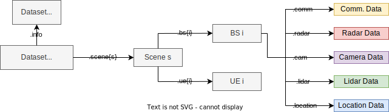
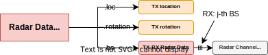
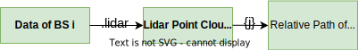

#######
Summary
#######

In this page, we present summary of the generated dataset's structure with diagrams. For the potential commands to call specific data and learn about its details, please check the commands page.
The final dataset is a matlab structure array with many fields representing different data points.
The main structure is presented in the image below. 

The corresponding data shown in the figure can be accessed by adding the commands presented over the arrows. If we generate a dataset into a variable named ``dataset``, the wireless data of the ``s``-th scene and ``i``-th basestation can be accessed by ``dataset.scene{s}.bs{i}.comm``.
Next, we present the details of different modality data.

Communication
=============

The communication data of the ``s``-th scene and ``i``-th basestation can be accessed by the following command.

.. code-block:: matlab

	dataset.scene{s}.bs{i}.comm

The communication data is a struct with the fields as shown in the image below.

Each channel between ``BS i`` and ``user j`` or ``BS j`` above carries a channel structure. In each channel structure, many details can be accessed as shown below.

Radar
=====

The radar data of the ``s``-th scene and ``i``-th basestation (as the transmitter) can be accessed by the following command.

.. code-block:: matlab

	dataset.scene{s}.bs{i}.radar

The radar data is a struct with the fields as shown in the image below.

Each radar channel structure between transmitter ``BS i`` and receiver ``BS j`` above carries a radar channel structure. In this structure, many details can be accessed as shown below.

Image
=====

The RGB camera image data of the ``s``-th scene, ``i``-th basestation's ``j``-th camera can be accessed by the following command.

.. code-block:: matlab

	dataset.scene{s}.bs{i}.cam{j}
	
The camera data is a struct with the fields as shown in the image below.

Lidar
=====

The lidar data of the ``s``-th scene, ``i``-th basestation's ``j``-th lidar can be accessed by the following command.

.. code-block:: matlab

	dataset.scene{s}.bs{i}.lidar{j}
	
The lidar data is a struct with the fields as shown in the image below.

