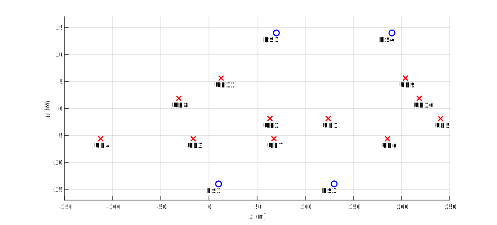
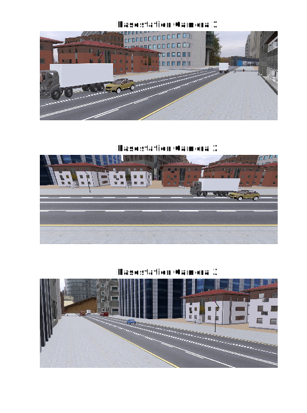
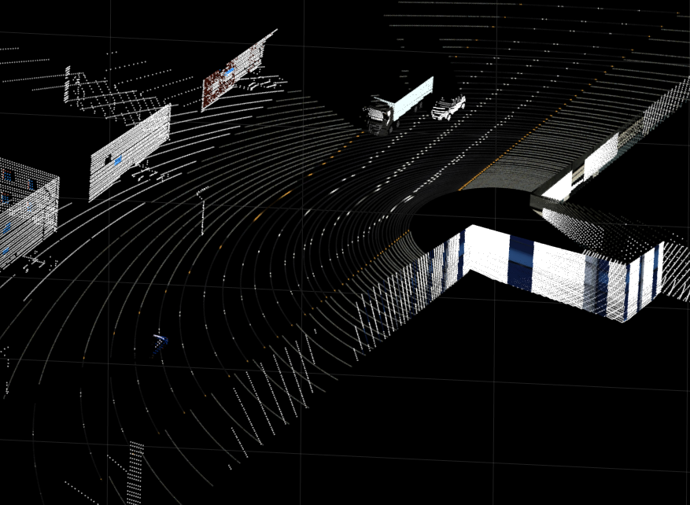
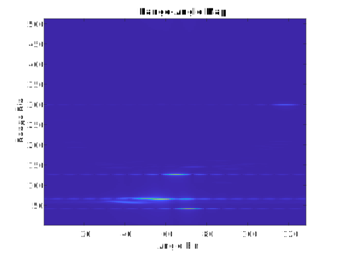
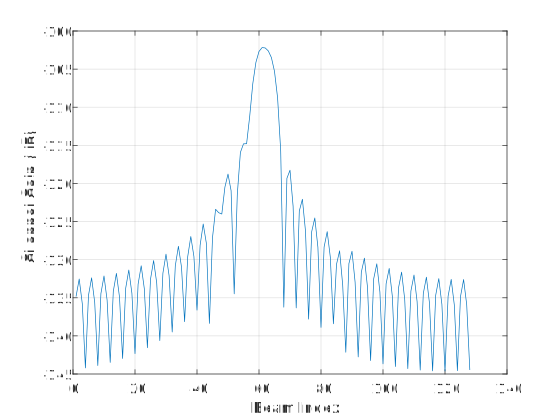

^^^^^^^^^^^^^^^^^^
Data Visualization
^^^^^^^^^^^^^^^^^^

In this example, we generate a dataset and visualize the modalities of the data.

Set the Parameters
==================
For this purpose, first, we design the parameters file as a single file as follows.

.. code-block:: matlab

	%% General Parameters
	dv.dataset_folder = '..\..\DV_Scenarios';
	dv.scenario = 'Scenario 1';
	dv.basestations = [1:4]; % Basestations to be included
	dv.scenes = [1000:1002]; % Scenes to be included
	dv.communication = true;
	dv.communication_parameters = '';
	dv.radar = true;
	dv.radar_parameters = '';
	dv.camera = true;
	dv.camera_id = [1, 2, 3];
	dv.lidar = true;
	dv.position = true;

	%% Comm
	comm.num_ant_BS = [32, 1, 1];
	comm.num_ant_UE = [1, 1, 1];
	comm.activate_array_rotation = 0;
	comm.array_rotation_BS = [5, 10, 20];
	comm.array_rotation_UE = [0, 30, 0];
	comm.ant_spacing_BS = .5;
	comm.ant_spacing_UE = .5;
	comm.bandwidth = 0.05;
	comm.activate_RX_filter = 0;
	comm.generate_OFDM_channels = 1;
	comm.num_paths = 25;
	comm.num_OFDM = 512;
	comm.OFDM_sampling_factor = 1;
	comm.OFDM_limit = 1; 

	%% Radar
	radar.num_ant_TX = [1, 1, 1];
	radar.num_ant_RX = [16, 1, 1];
	radar.activate_array_rotation = 0;
	radar.array_rotation_TX = [5, 10, 20];
	radar.array_rotation_RX = [5, 10, 20];
	radar.ant_spacing_TX = .5;
	radar.ant_spacing_RX = .5;
	radar.S = 15e12;
	radar.Fs = 15e6;
	radar.N_ADC = 512;
	radar.N_loop = 128;
	radar.T_idle = 7e-6;
	radar.T_start = 4.22e-6;
	radar.T_excess = 1e-6;
	radar.duty_cycle = 1;
	radar.F0 = 28e9 - radar.S*radar.T_start;
	radar.num_paths = 500;
	radar.radar_channel_taps = 1000; 
	radar.comp_speed = 5;

Generate a Dataset
==================

After setting the parameters, we now can generate a dataset, after adding the path of the DeepVerse scripts.

.. code-block:: matlab

	%% Add the DeepVerse scripts to the path 
	addpath(genpath('../../scripts')) % DeepVerse Scripts

	%% Generate a Dataset
	dataset = generate_deepverse_dataset('params.m');

Positions
=========

.. code-block:: matlab

	%% Plot 2D UE and BS positions
	figure;
	hold on;
	for bs_id = 1:length(dataset{1}.bs)
		x = dataset{1}.bs{bs_id}.comm.loc(1);
		y = dataset{1}.bs{bs_id}.comm.loc(2);
		plot(x, y, 'bo');
		text(x, y, strcat('BS ', num2str(bs_id)));
	end
	for ue_id = 1:length(dataset{1}.bs{bs_id}.comm.ue)
		x = dataset{1}.bs{bs_id}.comm.ue{ue_id}.loc(1);
		y = dataset{1}.bs{bs_id}.comm.ue{ue_id}.loc(2);
		plot(x, y, 'rx');
		text(x, y, strcat('UE ', num2str(ue_id)));
	end
	grid on;
	xlabel('x (m)');
	ylabel('y (m)');
	daspect([2 1 1])

  
  
We define some variables for plotting the other modalities.

.. code-block:: matlab

	%% Prepare Variables
	scenario_folder = dataset{1}.bs{1}.comm.parameters.scenario_folder; % Folder of the scenario
	scene_id = 1; % Select a scene
	bs_id = 3; % Select a BS
	ue_id = 1; % Select a UE

Camera Images
=============

.. code-block:: matlab

	figure;
	hold on;
	for cam_id=1:3
		subplot(3, 1, cam_id);
		im_path = fullfile(scenario_folder, dataset{scene_id}.bs{bs_id}.camera{cam_id}.data);
		imshow(im_path)
		title(sprintf('Basestation Camera %i', cam_id))
	end

  
  
Lidar Point Cloud Data
======================

With the MATLAB computer vision toolbox, we can visualize the point cloud data.

.. code-block:: matlab

	figure;
	pcd_path = fullfile(scenario_folder, dataset{scene_id}.bs{bs_id}.lidar{1}.data);
	ptCloud = pcread(pcd_path);
	pcshow(ptCloud);

  
  
Radar Range-Angle Maps
======================

We next visualize the radar signal with a range-angle map. For this purpose, we apply the classical radar signal processing, and then plot the range-angle map.

.. code-block:: matlab

	% Select the radar signal to process and visualize
	y = dataset{scene_id}.bs{bs_id}.radar.bs{bs_id}.IF_signal; % Radar signal from BS2 to BS2
	y = squeeze(y);

	% Radar Signal Processing
	y = fft(y, 256, 2); % Range FFT
	z = sum(sum(y, 1), 2); % Clutter computation
	y = y - z; % Clutter cleaning
	y = fft(y, 128, 3); % Doppler FFT
	y = fft(y, 128, 1); % 128-point Angle FFT
	y = flip(fftshift(y, 1)); % FFTshift Angle Bins
	y = fftshift(y, 3); % FFTshift Doppler Bins

	% Plot Range-Angle Map
	figure;
	imagesc(squeeze(sum(abs(y), 3))')
	set(gca,'YDir','normal') 
	xlabel('Angle Bin');
	ylabel('Range Bin');
	title('Range-Angle Map');

  
  
BS-UE Channel
======================

We next show the beam gain of the DFT codebook for the channel between the seelcted BS and UE.

.. code-block:: matlab

	h = dataset{scene_id}.bs{bs_id}.comm.ue{ue_id}.channel;
	figure;
	plot(pow2db(flip(abs(fft(h, 128)))));
	ylabel('Channel Gain (dB)')
	xlabel('Beam Index');
	grid on;

  